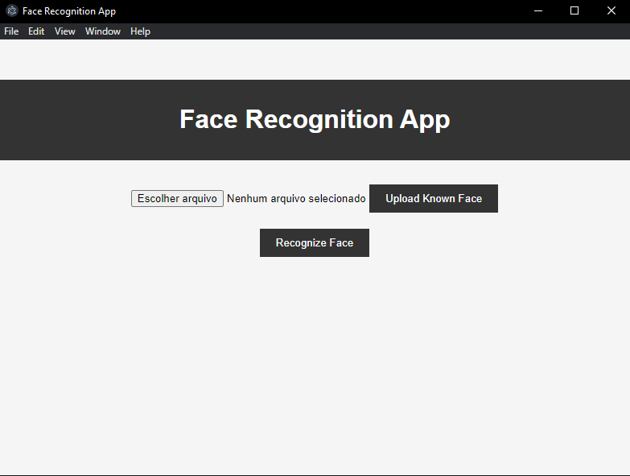

# Face Recognition App


This is a face recognition application that uses Electron for the front-end and Flask for the back-end. It leverages the Face++ API for face detection and comparison.

## Setup and Installation

### Prerequisites

- Python 3.x
- Node.js and npm
- Flask
- OpenCV
- Requests
- Dotenv
- Electron

### Installation Steps

1. Clone the repository:
    ```bash
    git clone https://github.com/sondercs/face-recognition-app.git
-cd face_recognition_app
    ```

2. Create and activate a virtual environment:
    ```bash
    python -m venv venv
    source venv/bin/activate  # On Windows use `venv\Scripts\activate`
    ```

3. Install the Python dependencies:
    ```bash
    pip install -r main/requirements.txt
    ```

4. Install the Node.js dependencies:
    ```bash
    npm install
    ```

5. Configure the environment variables in the `.env` file (You need to create):
    ```plaintext
    API_KEY=your_api_key
    API_SECRET=your_api_secret
    DETECT_URL=https://api-us.faceplusplus.com/facepp/v3/detect
    COMPARE_URL=https://api-us.faceplusplus.com/facepp/v3/compare
    ```

6. Create the `users-pictures` folder in the root of the project and add known face images (format `.jpg`, `.jpeg`, `.png`).

7. Start the Flask app:
    ```bash
    cd main
    python app.py
    ```

8. Start the Electron app:
    ```bash
    cd ..
    npm start
    ```

## Usage

- **Upload Known Images**: Use the form to upload images of known faces.
- **Facial Recognition**: Click the "Recognize Face" button to capture an image from the webcam and compare it with known images.

## Project Structure

### Back-end (Flask)
- `main/app.py`: Contains routes and logic for uploading images, capturing webcam frames, detecting faces, and comparing faces.

### Front-end (Electron)
- `renderer/index.html`: Main HTML page.
- `renderer/styles.css`: CSS styles.
- `renderer/scripts.js`: JavaScript for handling facial recognition requests and displaying results.
- `main.js`: Main Electron process file.
